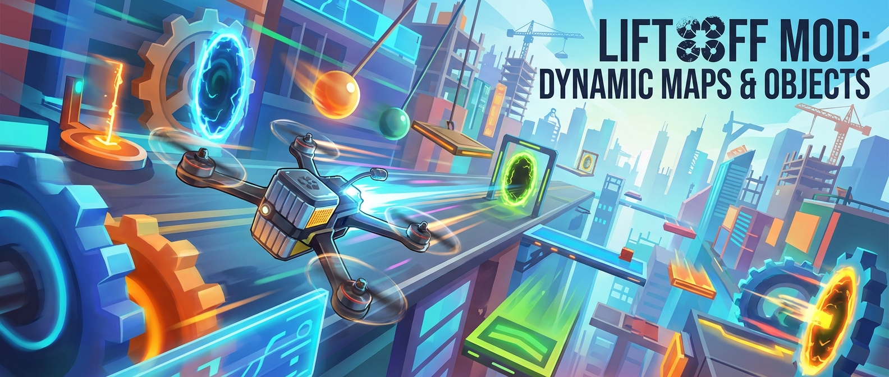

  

# 🚀 Liftoff Mod: Object in motion

> **Same map. Completely different experience.**  
> Adds animated, physics-driven, moving objects to Liftoff maps.

## ⚠️ Important Disclaimer

> [!WARNING]
> - This is an **unofficial community mod** and is **not supported** by the Liftoff developers.
> - Maps created with this mod **require the mod to be installed** to see animations.
> - Without the mod, maps will load normally — **but all objects will remain static**.

---

## 📚 Table of Contents

- Players
   - [What Is This Mod?](#-what-is-this-mod)
   - [Player Experience: With vs Without the Mod](#-player-experience-with-vs-without-the-mod)
   - [Showcase: Community Maps](#-showcase-community-maps)
- Map Creators 
   - [For Map Creators: What This Mod Enables](#-for-map-creators-what-this-mod-enables)
- [Key Features](#-key-features)
- [Installation](#-installation)
  - [Windows ✅](#windows-installation)
  - [macOS ⚠️ ](#macos-installation)
- [For Map Creators: Quick Start](#-for-map-creators-quick-start)
- [For Map Creators: Advanced Guides](#-for-map-creators-advanced-guides)
- [Built With](#-built-with)
- [Project Status](#-project-status)
- [Contributing](#-contributing)
- [Credits](#-credits)
- [FAQ](#-faq)
- [License](#-license)

---

## ✨ What Is This Mod?

**Liftoff MovingObjects Mod** extends the Liftoff track editor with **dynamic object behavior**.

It allows map creators to design maps where objects:
- move
- rotate
- fall
- react to drone interaction

Players experience these maps as **living environments**, not static tracks.

---

## 🎮 Player Experience: With vs Without the Mod

The **same map** behaves very differently depending on whether the mod is installed.

> [!warning]
> The documentation is still in progress. I haven't recorded the videos for the showcase yet, so only text is available at this time.

<table>
<tr>
<td width="50%" valign="top">

### ❌ Without MovingObjects Mod
- Objects are static
- No moving obstacles
- No dynamic reactions
- Traditional Liftoff experience

</td>
<td width="50%" valign="top">

### ✅ With MovingObjects Mod Installed
- Objects animate and move
- Physics-based interactions
- Reactive obstacles
- Cinematic, immersive maps

</td>
</tr>
</table>

> 💡 Players without the mod can still load the map — but **all animated objects will appear static**.

---

## 🌍 Showcase: Community Maps

Real maps created by the community using **Liftoff MovingObjects Mod**.

> ⚠️ **These maps require the mod to experience animations.**

### 🔧 Maps That Require This Mod

These maps rely on MovingObjects functionality.  
Without the mod, animated elements will remain static.

- **Industrial Motion Track**  
   [Steam link]( https://steamcommunity.com/sharedfiles/filedetails/?id=3221635840)
 

- **Honkey Kong (3 Laps)**  
   [Steam Link](https://steamcommunity.com/sharedfiles/filedetails/?id=3175684498)
  

- **Dynamic Factory Run**  
  [Steam Link](https://steamcommunity.com/sharedfiles/filedetails/?id=3222755049)

---

### 🕊 Freestyle Maps Using the Mod

These freestyle maps use MovingObjects for atmosphere, immersion, and dynamic elements.

- **MOD_PSHEK_FRPV_BANDO-NICE_1**  
  [Steam Link](https://steamcommunity.com/sharedfiles/filedetails/?id=3174317892)

- **Urban Motion Playground**  
  [Steam Link](https://steamcommunity.com/sharedfiles/filedetails/?id=3178495011)

- **Abandoned Complex Freestyle**  
  [Steam Link](https://steamcommunity.com/sharedfiles/filedetails/?id=3192255360)

- **Night Industry Freestyle**  
  [Steam Link](https://steamcommunity.com/sharedfiles/filedetails/?id=3217708243)

> ⭐ Want your map featured?  
> Open an issue or submit a pull request with your Workshop link.

---

## 🧑‍🎨 For Map Creators: What This Mod Enables

This mod turns the Liftoff editor into a **tool for designing moments**, not just layouts.

Creators can:
- Add step-based animations to objects
- Enable physics on map props
- Design reactive obstacles
- Unlock Blueprint map objects on any map

---

## 🧩 Key Features

### 🎞 Object Animation
Create step-by-step animations for supported objects.

---

### ⚙️ Physics-Based Objects
Objects can fall, rotate, or react dynamically.

---

### 🔓 Blueprint Objects Unlocked
Use Blueprint map objects on any map.

---

## 📦 Installation

### Windows Installation

1. Open Liftoff game directory  
   **Steam → Library → Liftoff → Manage → Browse local files**
2. Download the latest release:  
   👉 https://github.com/ps-hek/Liftoff.MovingObjects/releases/latest
3. Extract the archive **directly into the Liftoff folder**
4. Launch Liftoff

✅ Fully tested and supported.

---

### ⚠️  macOS Installation [not tested]

> [!warning]  
> The developer **has not tested this mod on macOS**.  
> Windows is confirmed working.  
>  ⚠️ macOS users proceed at their own risk.

Look details of installation here:  
👉 https://www.patreon.com/posts/how-to-pshek-mod-100095597

> [!NOTE]  
> Develeoper's notes about macos👇  
> 
> I don't have macos, I suggest using this tutorial (macos tabs).
> If bepinex starts, the mod will start too direct link to bepinex macos:
> https://github.com/BepInEx/BepInEx/releases/download/v5.4.22/BepInEx_unix_5.4.22.0.zip
>
> Installing BepInEx | BepInEx Docs
> BepInEx documentation and API listing
> https://docs.bepinex.dev/articles/user_guide/installation/index.html?tabs=tabid-nix 
>
> extract mod -> extract mac bepinex (with overwrite) -> run
> 
> **if this work i'll include in next release all-in-one package for mac**

Community testing feedback is welcome.

---

## 🧑‍🎨 For Map Creators: Quick Start

1. Open **Track Editor**
2. Select an object
3. Enable **MovingObject** properties
4. Configure:
   - Animation steps
   - Timing
   - Physics (optional)
5. Save and publish your map
6. Share the mod link with players

---

## 🧑‍🎨 For Map Creators: Advanced Guides

This README contains a **summary** of the full guide.

### Full Illustrated Tutorial

This is a ptreon of famous map developer. He didn't create this mod, but makes a lot of cool maps 

👉 https://www.patreon.com/posts/how-to-pshek-mod-100095597

👉 https://www.patreon.com/derhonk83   

Includes:
- Editor UI locations
- Property explanations
- Common mistakes
- Publishing best practices

---

## 🧱 Built With

- **Unity** – Liftoff game engine
- **BepInEx** – Modding framework
- **C#** – Core implementation language

---

## 📌 Project Status

- Actively not used in community maps
- Core functionality is stable
- Feature development is slow, last update was 2 years ago
- Documentation and maintenance contributions welcome

---

## ❓ FAQ

**Q: Will my map break without the mod installed?**  
A: No — it will load normally, but objects will be static.

**Q: Multiplayer - Do all players need the mod installed?**  
A: No, but it's recommended to see animations and movement. 

**Q: Is this an official Liftoff mod?**  
A: No — this is a community-made modification.

---

## 📜 License

No license selected yet.

> 🔧 **Recommendation:** MIT License (simple and mod-friendly)

---

## ⭐ Support the Project

If you enjoy this mod:
- ⭐ Star the repository
- 🔗 Link it on your Steam Workshop maps
- 🗺 Share it with map creators
- 🧪 Help test on macOS

---

**Fly smarter. Build living maps. 🚁**

